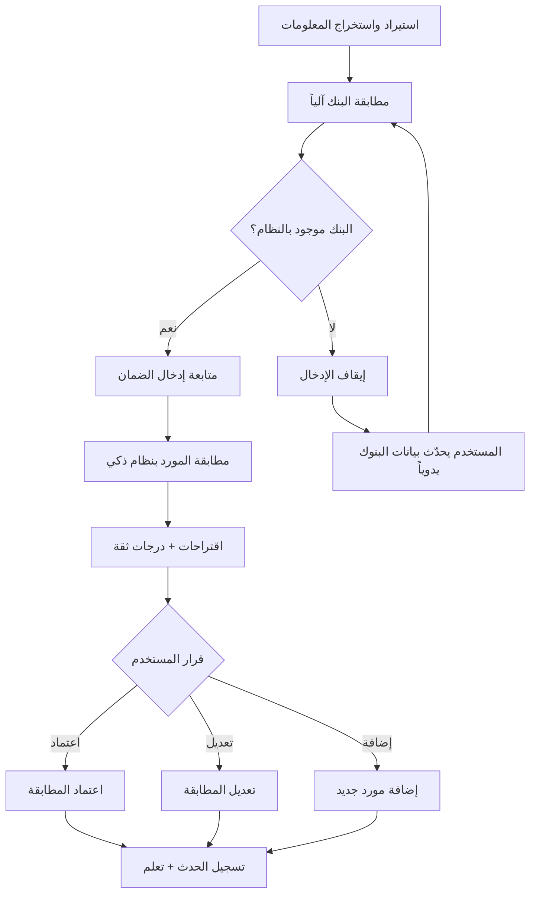

# WBGL — تقرير تجميعي شامل للمشروع

**تاريخ التقرير:** 2026-02-13  
**إعداد:** ملخص تجميعي من جلسات العمل الأخيرة

---

## 1) الهوية والاستقلال

- تم تحويل المشروع بالكامل ليعمل بهوية مستقلة باسم **WBGL**.
- تم فصل الربط عن المشروع السابق، وربط المستودع بمسار مستقل:
  - `git@github.com:bakhe8/WBGL.git`
- تم اعتماد الفرع التشغيلي على `main` ورفع الحالة النهائية للمشروع إلى GitHub.
- تم تحديث الهوية النصية في الملفات الرئيسية (README وواجهات المشروع والميتا داتا) لتتوافق مع WBGL.

---

## 2) الإعداد التشغيلي المحلي (Windows)

### الهدف التشغيلي
تشغيل المشروع محليًا بدون تضارب مع أي مشروع آخر على نفس الجهاز.

### ما تم اعتماده
- توحيد إدارة التشغيل في سكربت واحد:
  - `wbgl_server.ps1`
- توفير مشغل سريع:
  - `toggle.bat`
- توفير تشغيل صامت للاختصار المكتبي عبر ملف في **جذر المشروع**:
  - `WBGL_8181.vbs`

### سلوك التشغيل المعتمد
- التشغيل القياسي السريع: `toggle.bat`
- التشغيل الموحد عبر السكربت:
  - `-Action start | stop | restart | toggle`
- دعم منفذ ثابت عند الحاجة (مثل 8181).
- منع تضارب المنافذ عبر آلية إدارة تشغيل/إيقاف واضحة.

### سلوك الاختصار المكتبي
- الاختصار على سطح المكتب يشير إلى ملف VBS داخل جذر المشروع.
- ملف التشغيل الصامت **ليس** على سطح المكتب (تم نقله/توحيده داخل المشروع).

---

## 3) سياسة الحفظ والرفع (Git)

- تم تنفيذ حفظ الحالة الكاملة للمشروع كما هي عند الطلب ورفعها إلى GitHub.
- تم إنشاء Tag إصدار رسمي للمشروع:
  - `v1.0.0-wbgl`
- تم تنفيذ عدة commits تنظيمية لتوحيد التشغيل والهوية والاستقلال.

---

## 4) تنظيم الملفات والوثائق

- تم تحديث README بما يعكس الواقع التشغيلي الحالي.
- تم ضبط مسار التشغيل المحلي والسيناريوهات المعتمدة في Windows.
- تم اعتماد هيكل تشغيل أوضح مع نقطة دخول واحدة لإدارة الخادم.

---

## 5) نظام الدفعات (Batches)

- يوجد نظام دفعات فعلي داخل المشروع لإدارة المعالجة الجماعية للسجلات.
- النظام يغطي دورة عمل الدفعة من الإنشاء والمتابعة حتى تفاصيل الدفعة والطباعة.
- نظام الدفعات يدعم التشغيل اليومي عبر:
  - شاشة الدفعات.
  - شاشة تفاصيل الدفعة.
  - مخرجات الطباعة الخاصة بالدفعة.
- الدفعات تعتبر طبقة تنظيم وتشغيل فوق السجلات الفردية، وتساعد في المتابعة التشغيلية والتدقيق.

### ملاحظات ومرفقات الضمان

- يدعم النظام إضافة **ملاحظات** لأي ضمان بنكي كجزء من التوثيق التشغيلي.
- يدعم النظام إرفاق **مستندات/ملفات** لكل ضمان بنكي لدعم المراجعة والتدقيق.
- الملاحظات والمرفقات تُستخدم كمرجعية مساندة أثناء المتابعة التشغيلية واتخاذ القرار.

---

## 6) تقييم الفلو التنفيذي (Business/Operational Flow)

> هذا التقييم يركز على منطق التشغيل والتدفق، وليس مراجعة كود تفصيلية.

### نقاط القوة
- فلو إدخال متنوع: (ملف / يدوي / لصق) ضمن تجربة تشغيل واحدة.
- دورة تشغيل عملية تشمل: قرار → إجراء → متابعة السجل التالي.
- وجود Timeline فعّال كمرجع تشغيلي.
- وجود أنماط تشغيل محلية واضحة تقلل الاحتكاك اليومي.

### طرق الاستيراد والفروقات بينها

#### ملخص الفروقات

| طريقة الإدخال | نقطة الدخول | نوع البيانات | التعامل مع التكرار | شكل الدفعة | ملاحظات أساسية |
|---|---|---|---|---|---|
| استيراد Excel | `api/import.php` → `ImportService::importFromExcel` | صفوف ملف (`.xlsx/.xls`) | لا ينشئ سجلًا جديدًا عند التكرار؛ يسجل ظهورًا جديدًا (Occurrence) + حدث تكرار | `excel_...` أو `test_excel_...` | الأفضل للتحميل الجماعي ومعالجة صفوف كثيرة |
| إدخال يدوي | `api/create-guarantee.php` | حقول نموذج مباشرة | يرفض الإدخال إذا رقم الضمان موجود مسبقًا | `manual_paste_YYYYMMDD` أو `test_paste_YYYYMMDD` | الأفضل لحالة واحدة دقيقة مع تحقق حقول إلزامية |
| لصق ذكي | `api/parse-paste.php` → `ParseCoordinatorService::parseText` | نص حر غير منظم | عند التكرار يرجع للسجل الموجود ويسجل حدث تكرار | `manual_paste_YYYYMMDD` أو `test_paste_YYYYMMDD` | الأفضل للنصوص المنسوخة مع استخراج ذكي للحقول |

#### كيف تحدث الاستيرادات في كل طريقة

1) **استيراد Excel**
- يرفع المستخدم ملف Excel، ثم يتم التحقق من الامتداد ونقله مؤقتًا إلى `storage/uploads`.
- الخدمة تبحث بذكاء عن صف العناوين وتستخرج الأعمدة المطلوبة من كل صف.
- لكل صف صالح:
  - إنشاء سجل ضمان جديد (أو اعتباره مكررًا إذا الرقم موجود).
  - تسجيل `Occurrence` على الدفعة الحالية.
  - تسجيل حدث استيراد في `Timeline` للسجلات الجديدة.
- بعد انتهاء الاستيراد تُشغّل المطابقة الذكية تلقائيًا للسجلات الجديدة فقط.
- الناتج النهائي يتضمن: عدد المستورد، المتخطى، الأخطاء، وعدد المطابقات التلقائية.

2) **الإدخال اليدوي**
- يستقبل API حقول الضمان الأساسية بصيغة JSON ويتحقق من الحقول الإلزامية.
- يتحقق من عدم تكرار رقم الضمان مسبقًا (وفي حال التكرار يرفض العملية).
- ينشئ سجلًا واحدًا ويربطه بدفعة الإدخال اليومي، ثم يضمن وجود اسم الدفعة في `batch_metadata`.
- يسجل حدث الاستيراد في `Timeline`، ثم يشغّل المطابقة الذكية على هذا السجل.

3) **اللصق الذكي (Smart Paste)**
- يستقبل النظام نصًا حرًا، ثم يحاول استخراج حقول الضمان (رقم، مورد، بنك، مبلغ، تواريخ...).
- إذا كان الضمان موجودًا مسبقًا يسجل تكرارًا بدل إنشاء سجل جديد.
- إذا كان جديدًا:
  - ينشئ السجل في دفعة الإدخال/اللصق اليومية.
  - يسجل `Occurrence` وحدث الاستيراد في `Timeline`.
- بعد ذلك يتم تشغيل المطابقة الذكية للسجلات الجديدة الناتجة عن اللصق.

#### قواعد مشتركة بين جميع الطرق

- عند تفعيل `Production Mode` يتم منع إدخال بيانات الاختبار (`is_test_data=1`) في جميع مسارات الإنشاء.
- كل المسارات تنتهي بتسجيل تاريخي يسمح باسترجاع الحالة السابقة عبر `Timeline`.
- المطابقة الذكية تُستدعى بعد الإدخال لمعالجة السجلات الجديدة دون إيقاف نجاح عملية الاستيراد نفسها إذا فشلت المطابقة.
- يدعم النظام إعادة محاولة استيراد نفس الضمان عبر مسارات الإدخال.
- عند التكرار عبر **Excel** و**Smart Paste** يتم تسجيل حدث **استيراد مكرر** في سجل أحداث `Timeline` للضمان (Duplicate Import Event).
- في الإدخال اليدوي، تكرار رقم الضمان يُرفض قبل الإنشاء.
- هذا الحدث يثبت حصول المحاولة فقط، **دون تغيير حالة الضمان أو إعادة كتابة تاريخه التشغيلي** داخل النظام.

### تحديث مهم في التقييم
بناءً على التأكيد الأخير:
- **جميع الأحداث تحفظ حالة الضمان قبل الحدث**.

### توصيف دقيق لسلوك Timeline (حسب التشغيل الفعلي)
- الأحداث التي تظهر في Timeline تشمل:
  - الاستيراد.
  - المطابقة التلقائية للبنك.
  - المطابقة التلقائية أو اليدوية للمورد.
  - تحويل الحالة من **يحتاج مراجعة** إلى **جاهز**.
  - إجراءات ما بعد الجاهزية: **تمديد / تخفيض / إفراج**.
- الإجراءات الجديدة المستقبلية المقصودة: **التحقق من صحة الضمان** و**طلب إصدار بدل فاقد**.
- الإجراء الوحيد الذي ينتج عنه تغيير حالة الضمان هو **الإفراج**:
  - من **جاهز** إلى **مفرج عنه**.
  - وبعدها يصبح الضمان **Locked**.
  - هذا الانتقال يُسجل ضمن Timeline مثل بقية الأحداث.
- **جميع** الأحداث التشغيلية الحالية تُسجل في Timeline (الاستيراد، المطابقات، الأكشنات الحالية الثلاثة: **تمديد / تخفيض / إفراج**، وتغيرات الحالة)، وليس فقط انتقال الإفراج.
- عند الضغط على أي حدث في Timeline، تعرض الواجهة **الحالة السابقة للحدث** اعتمادًا على الـ Snapshot المخزن قبل التنفيذ.

### تسلسل استخراج المعلومات والمطابقة والتعلم
- **الاستيراد واستخراج المعلومات:**
  - النظام يقرأ المصدر (ملف / إدخال)، يستخرج الحقول الأساسية، ويوحّدها بصيغة داخلية.
  - يتم إنشاء/تحديث سجل الضمان بحسب البيانات المستخرجة، مع تسجيل الحدث في Timeline وحفظ Snapshot لما قبل الحدث.
- **مطابقة البنك:**
  - مطابقة البنك **آلية فقط** وغير مرتبطة بنظام تعلم.
  - تتم المطابقة وفق قائمة البنوك المعتمدة والموجودة مسبقًا داخل النظام.
  - إذا لم يوجد تطابق بنكي، قد يُنشأ الضمان وتبقى المطابقة البنكية غير مكتملة (pending) حتى تحديث البيانات المرجعية أو المعالجة اللاحقة.
- **مطابقة المورد:**
  - مرتبطة بنظام ذكي يتعلم من قرارات المستخدم السابقة.
  - يعرض اقتراحات للمورد مع **درجات ثقة** تساعد في تسريع القرار.
  - يتيح للمستخدم أثناء نفس خطوة المطابقة تنفيذ: الاعتماد، التعديل، أو إضافة مورد جديد.
  - قرارات المستخدم (اعتماد/تعديل/إضافة) تُستخدم لتحسين المطابقة المستقبلية.
  - كل قرار مطابقة للمورد يُسجل كحدث مستقل داخل Timeline.

### مخطط فرق المسارين (Bank vs Supplier)

هذا يرفع نضج الحوكمة بوضوح لأن:
- المرجعية التاريخية للضمان متاحة قبل كل تغيير.
- المستخدم البشري يستطيع فهم كيف كان الضمان قبل كل حدث داخل Timeline.
- التحليل التشغيلي وحل النزاعات يصبح أدق وأسرع.

### مصفوفة منطق الإجراءات وشروطها

| الإجراء | المنطق التشغيلي | الشرط الأساسي للتنفيذ | الأثر على الحالة | التسجيل في Timeline |
|---|---|---|---|---|
| الاستيراد واستخراج المعلومات | قراءة المصدر، استخراج الحقول، وتوحيدها داخليًا | توفر بيانات قابلة للمعالجة | إنشاء/تحديث سجل الضمان (غالبًا يبدأ من يحتاج مراجعة) | يسجل حدث الاستيراد مع Snapshot قبل الحدث |
| مطابقة البنك | مطابقة آلية فقط مقابل بنوك النظام المعتمدة | وجود البنك ضمن بيانات البنوك في النظام | عند عدم وجود البنك يتوقف إدخال الضمان حتى تحديث بيانات البنوك يدويًا | يسجل حدث المطابقة البنكية |
| مطابقة المورد | مطابقة ذكية مبنية على قرارات سابقة مع اقتراحات وثقة | توفر مورد مطابق أو قرار مستخدم (اعتماد/تعديل/إضافة) | تثبيت المورد المختار أو المضاف ضمن السجل | يسجل كل قرار مطابقة مورد كحدث مستقل |
| التحويل إلى جاهز | انتقال بعد اكتمال المتطلبات التشغيلية للمعالجة | اكتمال شروط المعالجة والمراجعة المطلوبة | تغيير الحالة من يحتاج مراجعة إلى جاهز | يسجل انتقال الحالة كحدث |
| تمديد | إجراء تشغيلي على ضمان قابل للتعديل | تحقق شروط التمديد وعدم كونه مفرجًا عنه/مقفلًا | تحديث بيانات الضمان وفق منطق التمديد | يسجل كحدث مع Snapshot قبل التنفيذ |
| تخفيض | إجراء تشغيلي على ضمان قابل للتعديل | تحقق شروط التخفيض وعدم كونه مفرجًا عنه/مقفلًا | تحديث بيانات الضمان وفق منطق التخفيض | يسجل كحدث مع Snapshot قبل التنفيذ |
| إفراج | إغلاق دورة الضمان تشغيليًا | كون الضمان في حالة جاهز وتحقق شروط الإفراج | تغيير الحالة من جاهز إلى مفرج عنه ثم يصبح Locked | يسجل كحدث، وهو الإجراء الوحيد الذي يغير الحالة إلى مفرج عنه |
| إضافة ملاحظة | توثيق معلومات تشغيلية إضافية على الضمان | اختيار الضمان وإدخال نص الملاحظة | لا يغيّر حالة الضمان مباشرة | يسجل كحدث ملاحظة ضمن التسلسل التاريخي |
| إرفاق مستند | ربط ملف داعم بسجل الضمان | اختيار الضمان ورفع ملف صالح | لا يغيّر حالة الضمان مباشرة | يسجل كحدث إرفاق مع مرجع للمستند |
| التحقق من صحة الضمان (مستقبلي) | إجراء تحقق إضافي قبل/أثناء المعالجة | يُفعل عند اعتماد الإجراء مستقبلًا | يحدد صلاحية الضمان بحسب قواعد التحقق | عند تنفيذه مستقبلًا يسجل كحدث |
| طلب إصدار بدل فاقد (مستقبلي) | إجراء معالجة حالة فقدان | يُفعل عند اعتماد الإجراء مستقبلًا واستيفاء شروطه | تنفيذ مسار بدل فاقد بحسب السياسة المعتمدة | عند تنفيذه مستقبلًا يسجل كحدث |

### ميزات تبويب التعلم الآلي (في الإعدادات)

- يعرض التبويب **حالة نظام التعلم** عبر مؤشرين رئيسيين:
  - عدد الأنماط المؤكدة (Confirmations).
  - عدد حالات الرفض/العقاب (Rejections).
- يدعم **التعلم الإيجابي** عبر الأنماط المؤكدة التي رفعها المستخدمون سابقًا، وتُستخدم لرفع جودة الاقتراحات.
- يدعم **التعلم السلبي** عبر سجل الرفض (Rejections) مع تطبيق خصم ثقة تراكمي على الأنماط المرفوضة.
- يدعم إدارة المعرفة المتعلمة مباشرة من التبويب:
  - حذف/نسيان نمط متعلم.
  - إلغاء عقوبة نمط مرفوض (عبر إزالة سجل الرفض).
- يحتوي على **إعدادات قابلة للضبط** تؤثر على سلوك التعلم، مثل:
  - نسبة العقوبة لكل رفض (`REJECTION_PENALTY_PERCENTAGE`).
  - مستويات تعزيز التأكيد (`CONFIRMATION_BOOST_TIER1/2/3`).
  - أوزان درجات المطابقة الأساسية (Anchors/Fuzzy/Historical).
- هذه الميزات تخص مسار **مطابقة المورد الذكي**، ولا تغيّر قاعدة أن **مطابقة البنك آلية غير متعلمة**.

### معنى Production Mode وكيف يعمل مع قاعدة البيانات

- عند تفعيل `PRODUCTION_MODE` (محفوظ في `storage/settings.json`) يتحول النظام إلى نمط تشغيل إنتاجي يقيّد بيانات الاختبار.
- على مستوى **الإدخال (Write Path)**:
  - يتم رفض إنشاء بيانات اختبار (`is_test_data=1`) في واجهات الإدخال الأساسية مثل:
    - `api/create-guarantee.php`
    - `api/import.php`
    - `api/parse-paste.php`
  - نتيجة الرفض تكون `403` مع رسالة: لا يمكن إنشاء بيانات اختبار في وضع الإنتاج.
- على مستوى **العرض والتقارير (Read Path)**:
  - لا تُحذف بيانات الاختبار من قاعدة البيانات، لكنها تُستبعد من نتائج العرض عبر شرط فلترة:
  - `(is_test_data = 0 OR is_test_data IS NULL)`
  - هذه الفلترة مطبقة في الشاشات/الخدمات الأساسية مثل الإحصائيات، التنقل، الدفعات، وتصدير/طباعة الدفعات.
- على مستوى **أدوات الصيانة**:
  - في وضع الإنتاج يتم تعطيل/إخفاء أدوات إدارة وحذف بيانات الاختبار في صفحة الصيانة.
- على مستوى **السجلات (Logs)**:
  - سجلات `DEBUG` تتوقف في وضع الإنتاج، بينما سجلات `INFO/WARNING/ERROR` تبقى فعالة.
- خلاصة قاعدة البيانات:
  - `Production Mode` لا ينفذ `DELETE` تلقائيًا لبيانات الاختبار.
  - التأثير الفعلي هو: **منع إنشاء اختبار جديد + فلترة اختبار موجود من واجهات التشغيل**.

#### جدول تحقق سريع (Write vs Read)

| المسار | النوع | في وضع الإنتاج | التفاصيل |
|---|---|---|---|
| `api/create-guarantee.php` | كتابة (إنشاء ضمان) | ✅ منع بيانات الاختبار | يرفض الطلب إذا `is_test_data=1` ويعيد `403` |
| `api/import.php` | كتابة (استيراد Excel) | ✅ منع بيانات الاختبار | يرفض الاستيراد الاختباري إذا `is_test_data=1` |
| `api/parse-paste.php` | كتابة (تحليل/إدخال لصق) | ✅ منع بيانات الاختبار | يرفض الإدخال الاختباري إذا `is_test_data=1` |
| `views/statistics.php` | قراءة (تقارير/إحصائيات) | ✅ فلترة بيانات الاختبار | يطبق شرط `(is_test_data = 0 OR is_test_data IS NULL)` |
| `app/Services/StatsService.php` | قراءة (إحصاءات عامة) | ✅ فلترة بيانات الاختبار | نفس شرط الفلترة على الاستعلامات |
| `app/Services/NavigationService.php` | قراءة (تنقل/عدّاد) | ✅ فلترة بيانات الاختبار | يستبعد سجلات الاختبار من التصفح والعد |
| `views/batches.php` | قراءة (قائمة الدفعات) | ✅ فلترة وإخفاء دفعات الاختبار | يستبعد دفعات `test_` ويحسب السجلات غير الاختبارية فقط |
| `views/batch-detail.php` | قراءة (تفاصيل الدفعة) | ✅ فلترة بيانات الاختبار | يعرض فقط السجلات غير الاختبارية داخل الدفعة |
| `views/batch-print.php` | قراءة (طباعة) | ✅ فلترة بيانات الاختبار | يمنع طباعة سجلات اختبار في وضع الإنتاج |
| `views/maintenance.php` | صيانة/إدارة | ✅ تعطيل أدوات حذف/إدارة الاختبار | يعرض رسالة بأن أدوات بيانات الاختبار غير متاحة |
| `app/Support/Logger.php` | سجلات | ✅ تعطيل `DEBUG` فقط | تبقى `INFO/WARNING/ERROR` فعالة |

### باقي الإعدادات: أين تُحفظ وما فائدتها

- الإعدادات العامة للنظام (عتبات المطابقة، أوزان الدرجات، إعدادات التعلم، المنطقة الزمنية، `PRODUCTION_MODE`) تُدار من صفحة الإعدادات وتُحفظ عبر:
  - واجهة: `views/settings.php`
  - API حفظ/تحميل: `api/settings.php`
  - ملف التخزين الدائم: `storage/settings.json`
  - القيم الافتراضية والقراءة المركزية: `app/Support/Settings.php`
- آلية الحفظ:
  - الواجهة ترسل JSON إلى `api/settings.php`.
  - الـAPI يطبق تحققًا على القيم (حدود المدى والمنطق) قبل الحفظ.
  - بعد النجاح تُحدّث الصفحة ليبدأ تطبيق القيم الجديدة على الشاشات والخدمات.

#### مصفوفة الإعدادات المتبقية

| مجموعة الإعدادات | أمثلة | مكان الحفظ الأساسي | الفائدة التشغيلية |
|---|---|---|---|
| عتبات المطابقة | `MATCH_AUTO_THRESHOLD`, `MATCH_REVIEW_THRESHOLD`, `MATCH_WEAK_THRESHOLD` | `storage/settings.json` (مع defaults في `Settings.php`) | التحكم بصرامة القبول التلقائي ومتى تظهر الاقتراحات للمراجعة |
| درجات/أوزان التقييم | `BASE_SCORE_*`, `CONFLICT_DELTA`, `CANDIDATES_LIMIT` | `storage/settings.json` | ضبط ترتيب وجودة نتائج المطابقة وعدد الاقتراحات المعروضة |
| إعدادات التعلم | `REJECTION_PENALTY_PERCENTAGE`, `CONFIRMATION_BOOST_TIER1/2/3` | `storage/settings.json` | تحديد أثر التعلم السلبي/الإيجابي على ثقة اقتراحات المورد |
| إعدادات واجهة الثقة | `LEVEL_B_THRESHOLD`, `LEVEL_C_THRESHOLD` | `storage/settings.json` | توحيد تصنيف درجات الثقة بصريًا وعمليًا للمستخدم |
| إعدادات النظام | `TIMEZONE`, `PRODUCTION_MODE` | `storage/settings.json` | دقة التواريخ/الأوقات وحماية بيئة الإنتاج من بيانات الاختبار |
| البنوك (Master Data) | أسماء البنوك والصيغ البديلة | قاعدة البيانات (جداول البنوك) | مرجع المطابقة البنكية الآلية؛ بدونه يتوقف إدخال الضمان عند بنك غير معروف |
| الموردون (Master Data) | أسماء الموردين وتأكيداتهم | قاعدة البيانات (جداول الموردين + جداول التعلم) | تحسين المطابقة الذكية وتوفير اقتراحات أدق مع الزمن |
| أنماط التعلم | Confirmations / Rejections | قاعدة البيانات (`learning_confirmations` وغيرها) | حفظ ذاكرة النظام (تعلم إيجابي/سلبي) واسترجاعها في الاقتراحات |

- ملاحظة مهمة: ملفات JSON الخاصة بتصدير/استيراد البنوك والموردين هي **ملفات تبادل**، بينما المصدر الدائم للحقيقة بعد الاستيراد هو قاعدة البيانات.

### صفحة الإحصائيات المتقدمة (views/statistics.php)

- صفحة الإحصائيات تمثل لوحة تحليل تشغيلية وتنفيذية شاملة، وتعتمد مباشرة على قاعدة البيانات (SQLite) مع استعلامات مجمعة.
- محاور القياس الأساسية في الصفحة تشمل:
  - **المؤشرات العامة:** إجمالي الضمانات (Assets)، إجمالي التكرارات (Occurrences)، الضمانات النشطة، الدفعات النشطة، ومؤشرات المبالغ (إجمالي/متوسط/أعلى/أدنى).
  - **تحليل الدفعات:** آخر الدفعات، حجم كل دفعة، التفريق بين العناصر الجديدة والمتكررة، وأكثر الضمانات تكرارًا.
  - **تحليل البنوك والموردين:** أفضل الموردين والبنوك، الموردون المستقرون/عالي المخاطر، أزواج بنك-مورد الأكثر تكرارًا.
  - **الزمن والأداء:** متوسط زمن المعالجة، ساعة الذروة، يوم الذروة، الاتجاه الأسبوعي، ومؤشر First-Time-Right.
  - **الانتهاء والإجراءات:** ضغوط الانتهاء (30/90 يوم)، شهر الذروة للانتهاء، وعدّادات (تمديد/تخفيض/إفراج).
  - **الذكاء الاصطناعي والتعلم:** نسبة المطابقة الآلية مقابل اليدوية، مؤشرات التعلم (Confirm/Reject)، وتوزيع الثقة.
  - **التحليل المالي والأنواع:** توزيع أنواع الضمانات، ارتباط قيمة الضمان باحتمال التمديد، ومؤشرات ROI (وقت/تكلفة موفرة).
- مصادر البيانات المعتمدة في الصفحة تشمل جداول مثل:
  - `guarantees`
  - `guarantee_occurrences`
  - `guarantee_decisions`
  - `guarantee_history`
  - `batch_metadata`
  - `banks` / `suppliers`
  - `learning_confirmations` و`learning_patterns` (عند توفرها)
- تكامل الصفحة مع `Production Mode`:
  - عند التفعيل، جميع المؤشرات والتجميعات في الصفحة تُفلتر لاستبعاد بيانات الاختبار عبر شرط `is_test_data`.
  - هذا يعني أن أرقام لوحة الإحصائيات في الإنتاج تعكس البيانات التشغيلية الحقيقية فقط.
- ملاحظة تشغيلية:
  - الصفحة تُحمّل مع `no-cache` لتقليل مخاطر عرض بيانات قديمة أثناء المراقبة اليومية.

### إدارة البنوك والموردين من صفحة الإعدادات

- صفحة الإعدادات (`views/settings.php`) تحتوي تبويبين تشغيليين مخصصين لإدارة البيانات المرجعية:
  - تبويب **البنوك**.
  - تبويب **الموردين**.
- كلا التبويبين يدعمان نفس عائلة العمليات: **عرض / إضافة / تعديل / حذف / تصدير / استيراد**.

#### عمليات تبويب البنوك

- **عرض البنوك:** تحميل الجدول من `api/get_banks.php`.
- **إضافة بنك يدويًا:** عبر نموذج الإضافة ثم الحفظ إلى `api/create-bank.php`.
- **تعديل بنك:** حفظ التعديلات الصفية عبر `api/update_bank.php`.
- **حذف بنك:** حذف السجل عبر `api/delete_bank.php` بعد تأكيد المستخدم.
- **تصدير بنوك:** تنزيل JSON عبر `api/export_banks.php`.
- **استيراد بنوك:** رفع JSON عبر `api/import_banks.php`.
- ملاحظة وظيفية: إدارة صيغ/أسماء البنك البديلة (Aliases) متاحة من واجهة الإضافة، وهي مهمة لتحسين المطابقة البنكية الآلية.

#### عمليات تبويب الموردين

- **عرض الموردين:** تحميل الجدول من `api/get_suppliers.php`.
- **إضافة مورد يدويًا:** عبر نموذج الإضافة ثم الحفظ إلى `api/create-supplier.php`.
- **تعديل مورد:** حفظ التعديلات الصفية عبر `api/update_supplier.php`.
- **حذف مورد:** حذف السجل عبر `api/delete_supplier.php` بعد تأكيد المستخدم.
- **تصدير موردين:** تنزيل JSON عبر `api/export_suppliers.php`.
- **استيراد موردين:** رفع JSON عبر `api/import_suppliers.php`.
- ملاحظة وظيفية: تحديث بيانات الموردين ينعكس مباشرة على جودة اقتراحات المطابقة الذكية في مسار المورد.

#### الفائدة التشغيلية لهذا القسم

- تمكين فريق التشغيل من صيانة البيانات المرجعية بدون تدخل برمجي.
- تسريع تصحيح حالات "بنك غير معروف" عبر تحديث قائمة البنوك.
- تحسين دقة المطابقة الذكية للموردين عبر الإضافة/التعديل المستمرين.
- دعم النقل/النسخ بين البيئات (أو النسخ الاحتياطي) عبر الاستيراد والتصدير بصيغة JSON.

### نموذج الخطابات الثابت (المخرج الرسمي للنظام)

- المخرج التشغيلي الرسمي للنظام هو **خطاب بنكي** يتم توليده وفق نموذج ثابت ومعتمد.
- لكل إجراء تشغيلي أساسي (تمديد / تخفيض / إفراج) يتم بناء خطاب بنفس الهيكل القياسي مع تغيير المحتوى الخاص بالإجراء.
- النظام يعتمد مبدأ **Single Source of Truth** في بناء الخطابات عبر:
  - خدمة توليد موحدة: `app/Services/LetterBuilder.php`
  - قالب عرض موحد: `templates/letter-template.php`
  - وعرض/معاينة عبر المسارات المخصصة مثل `api/get-letter-preview.php` وواجهة الطباعة المجمعة.
- ثبات النموذج يعني:
  - شكل ومواصفات موحدة للخطاب.
  - تقليل التباين بين المخرجات الفردية والمجمعة.
  - سهولة التدقيق والاعتماد لأن جميع الخطابات تُبنى بنفس القاعدة.
- المتغيرات الديناميكية داخل القالب (مثل رقم الضمان، رقم العقد/الأمر، بيانات البنك، بيانات المورد، ونص الإجراء) تُحقن في أماكن ثابتة دون تغيير هيكل المستند.

### التقييم التنفيذي بعد هذا التحديث
- نضج الفلو التشغيلي: **8/10**
- نضج الحوكمة والتتبع: **8.5/10**
- الجاهزية للإنتاج التشغيلي: **8/10**

---

## 7) توصيات تشغيلية (غير برمجية)

1. **تعزيز عرض Timeline بصريًا**
   - عرض واضح لعناصر: الحالة قبل الحدث / الإجراء / الحالة بعد الحدث.

2. **توحيد القاموس التشغيلي للمستخدم النهائي**
   - توحيد أسماء الحالة والإجراءات في اللغة المعروضة لتقليل اللبس في القراءة اليومية.

3. **توثيق إجرائي لفريق التشغيل**
   - وثيقة قصيرة (SOP) لرحلة: إدخال → مراجعة → إجراء → إقفال.

---

## 8) الحالة النهائية الحالية

- المشروع مستقل ومرفوع على GitHub باسم WBGL.
- التشغيل المحلي موحد ومنظم، مع دعم التشغيل الصامت عبر اختصار مكتبي.
- منطق التتبع التاريخي للأحداث مع حفظ حالة ما قبل الحدث معتمد، وهو عنصر قوي في التدقيق التشغيلي.

---

## 9) ملخص تنفيذي (صفحة واحدة)

- **الغرض التشغيلي:** WBGL نظام تشغيل ومتابعة ضمانات بنكية مع تدقيق تاريخي كامل لكل حدث.
- **نطاق الإدخال:** ثلاث قنوات إدخال رئيسية (Excel / إدخال يدوي / لصق ذكي) مع توحيد مسار التسجيل التاريخي بعد الإدخال.
- **قاعدة المطابقة:**
  - مطابقة البنك آلية غير متعلمة وتعتمد على Master Data البنوك.
  - مطابقة المورد ذكية متعلمة بدرجات ثقة واقتراحات مع دعم الاعتماد/التعديل/الإضافة.
- **الحدث التاريخي (Timeline):** جميع الأحداث التشغيلية تُسجل مع Snapshot قبل الحدث، بما يشمل محاولات الاستيراد المكرر دون تغيير حالة الضمان.
- **الإجراءات الحالية المعتمدة:** تمديد، تخفيض، إفراج؛ والإفراج هو الوحيد الذي يحول الحالة إلى مفرج عنه ثم يقفل الضمان (Locked).
- **الإنتاج (Production Mode):** يمنع إنشاء بيانات اختبار جديدة، ويُبقيها مخزنة لكن مستبعدة من القراءة والتقارير والطباعة؛ مع تعطيل أدوات صيانة بيانات الاختبار.
- **البيانات المرجعية:** إدارة كاملة للبنوك والموردين من الإعدادات (إضافة/تعديل/حذف/استيراد/تصدير) لرفع جودة التشغيل والمطابقة.
- **القياس والتحكم:** صفحة الإحصائيات تجمع مؤشرات التشغيل (دفعات، أداء، إجراءات، تعلم، ROI) وتدعم المتابعة التنفيذية.
- **المخرج الرسمي للنظام:** خطابات معيارية ثابتة لكل إجراء عبر قالب موحد وخدمة توليد موحدة.
- **الخلاصة التنفيذية:** النظام جاهز تشغيليًا بهيكل حوكمة واضح، تعلم متدرج قابل للضبط، ومخرجات رسمية متسقة.

---

## 10) ملاحظة ختامية

هذا التقرير يعكس ما تم تثبيته في جلسات العمل الأخيرة، وهو مرجع موحد للحالة التشغيلية والتنظيمية للمشروع حتى تاريخ 2026-02-13.
